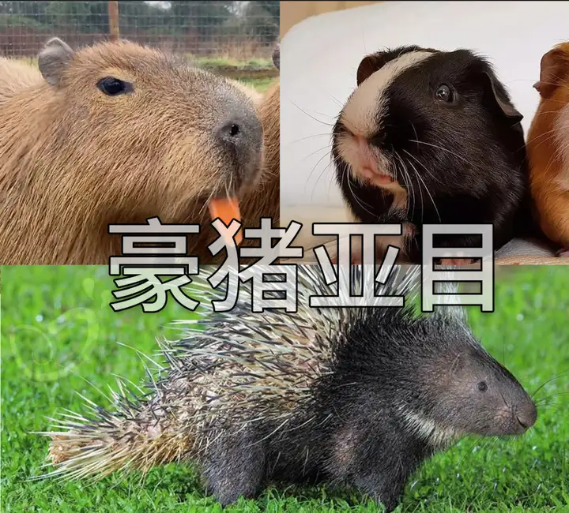
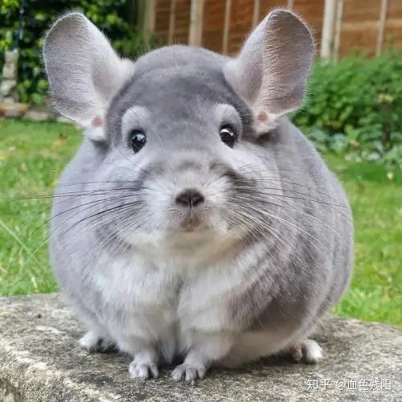
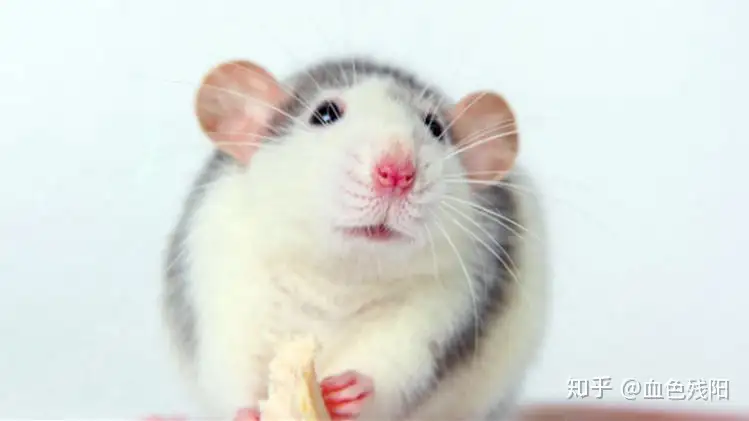

---
tags:
  - biology
  - animal
aliases: []
id: Animal_Diff
---

## 区分水獭、海獭、海狸、河狸、水豚？

[ref](https://www.zhihu.com/question/38706109)

河狸、海狸、水豚都是啮齿目动物，都有4颗不停生长的大门牙，海狸是河狸的俗称(河狸的牙齿中含有水合铁，所以是黄色的)。
水豚，豚鼠，豪猪，龙猫等动物都属于豪猪亚目

## 如何区分仓鼠、豚鼠、栗鼠、花枝鼠、松鼠？
https://www.zhihu.com/question/389065889

仓鼠两颊均有颊囊，可将食物暂存口内。

豚鼠和老鼠，也就是鼠科，亲缘关系比较远，没有尾巴，也叫荷兰猪、天竺鼠，野外已灭绝

栗鼠，又称龙猫、毛丝鼠，驯化历史最近，易危。

花枝鼠，是大白鼠的一种，因其黑白相间的毛色又称奶牛大白鼠。

## 如何区分海豹、海象、海狗、海狮、海牛？

https://www.zhihu.com/question/25742151/answer/2930745662

