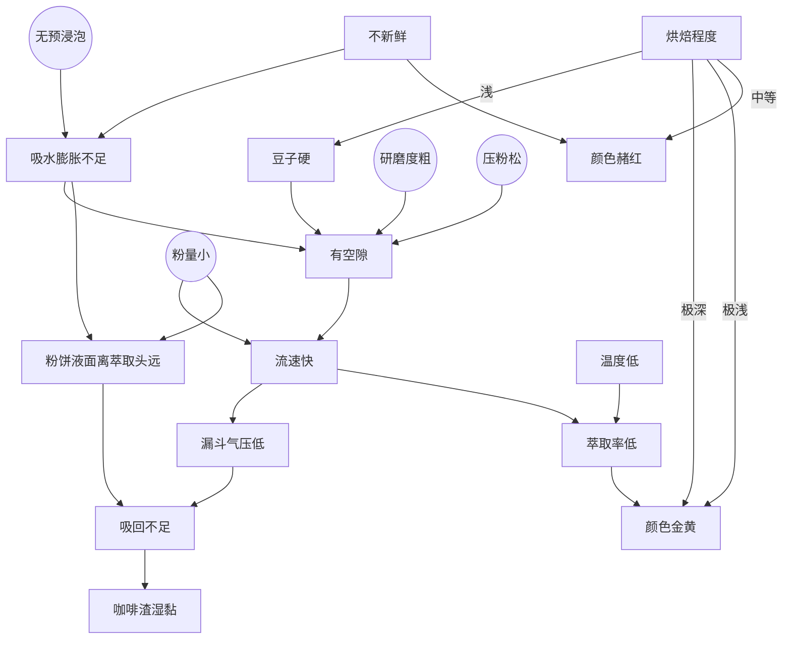

# 分类

## 冲调

美式咖啡：稀释的咖啡，获得方式 1. 以滴滤的形式获得的咖啡 2. 意式兑水

意式咖啡（espresso）：浓咖啡

| Drink              | Ratio                                      |
| ------------------ | ------------------------------------------ |
| Latte              | 1:2-1:3 (Espresso : Steamed milk)          |
| Cappuccino         | 1:1:1(Espresso : Steamed milk : Milk foam) |
| Macchiato          | 4:1-9:1 (Espresso : Milk foam)             |
| Frappuccino/Frappe | Varies (Coffee or Espresso, Milk, Ice)     |
| Mocha              | Coffee+Chocolate                           |

## 咖啡豆

- Arabica: 总产量最多，风味丰富，咖啡因含量低，精品咖啡常用
- Robusta：总产量较少，醇苦，咖啡因含量高，单位产量高，便宜，速溶咖啡常用
- Liberica：总产量稀少，木香或烟熏味

> [!info]
> Arabica源自其最早贸易地区，阿拉伯半岛。Robusta源自拉丁语强壮。Liberica源自西非国家利比里亚。它们同咖啡属但不同种。

## 烘焙程度

烘焙程度对咖啡因含量影响不大，不过抗氧化剂，例如绿原酸，对热敏感，浅烘焙会保留更多。

深烘豆体积更大、更轻。如果你同样用一勺咖啡豆，深烘豆的数量实际上比浅烘豆少，因此冲出来的咖啡咖啡因更少。

# 制备

萃取程度越大，味道越苦，层次越丰富；程度越小，味道越酸，层次越单薄；程度过小，没味道、没香气。

萃取程度越大<-咖啡研磨度越细、温度越高、流速越慢、萃取时间越长

## 手冲

咖啡豆三个月之内吃最香

1. 咖啡研磨度：白砂糖颗粒度
2. 水粉比：18.18比1，或 11 g 粉泡 200 ml 水
3. 水温：88-95
4. 时间：4.5分钟

## 咖啡机

25-30s出两倍于粉重的咖啡液（例如18g粉出36g液）

where the circle block is what you can control when using the machine.

## 拉花

### 原理

Crema(咖啡油)密度小浮在上面，奶泡密度小浮在上面，两者颜色不同且不相溶；而咖啡液和牛奶则在下面混在一起。

所以Espresso要深色且有油脂(深焙)，牛奶要全脂，奶泡要细腻。拉花比赛中参赛者甚至会用triple的滤杯获得更浓的Ristretto。

> [!note]
> 浓度上 Ristretto > Espresso > Lungo > Americano

### 标准

- 图案正
- 边界实
- 对比高

### 诀窍

1. 可以全程一直摇晃奶缸使得泡泡分布更均匀
2. 咖啡也要摇一下让杯壁上沾上crema，让液面上升更顺滑
3. 融合阶段：开始的时候可以将咖啡杯倾斜获得更深的液面，这样气泡可以被牛奶带到底下去融合。随着咖啡杯渐满逐渐放平。
4. 拉花阶段：奶缸离液面近就出花、不融合，排斥液面，获得膨胀的效果；远就不出花、融合，吸引液面，获得收缩的效果。流速大，则对流大，颜色散；流速小，则堆在一块(在画经典爱心时是需要液体流动的，[见此视频](https://www.bilibili.com/video/BV14G411x7sD))。
5. 打奶后过一段时间再倒会导致奶和泡分离，不均匀。
