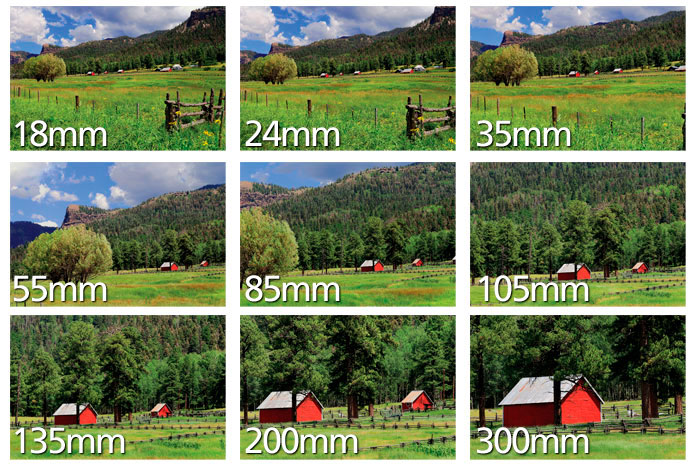
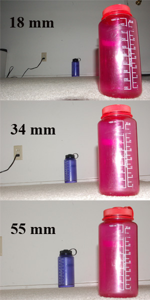
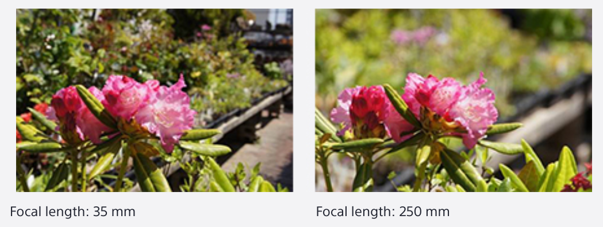

---
tags:
  - hobby
---

# Resources
https://zhuanlan.zhihu.com/p/305714803

# Lens

Larger **focal length**
- narrower angle of view [Interactive demo](https://www.sony.co.nz/electronics/focal-length-angle-of-view-perspective)

- the sizes of foreground and background objects are closer to the real world(reason: narrower angle of view -> more distant -> parallel projection)

- Narrower depth of field(DOF) (reason: larger aperture when keeping F-number unchanged)

Larger **aperture**
- brighter
- narrower depth of field
- less diffraction, higher quality (That's why high resolution camera tends to use larger aperture.)

> [!note]- Why we use F-number?
> Under the paraxial approximation, when the focal length is doubled, the
magnification of the image also doubles, which means the light intensity is 1/4
of the original. That's why aperture uses F-number math.

Larger **sensor size**
- shorter effective focal length
- less diffraction (reason: larger photosensitive unit in the same resolution)

