---
tags:
  - image-management
  - dressing
---

# History

Suivre(French, 跟随)  -> Suit，意思是上下用同一块面料做的套装([[Suit#^975350|two-piece suit]])

近代传入中国，原型为17世纪法国宫廷服饰，法国时尚启蒙源自意大利嫁过去的凯瑟琳美第奇，而意大利的时尚启蒙源自对中国丝绸的模仿。（时尚是个圈）

# Style

## 按形制分
### 领型
平驳领（保守商务套装或休闲套装）
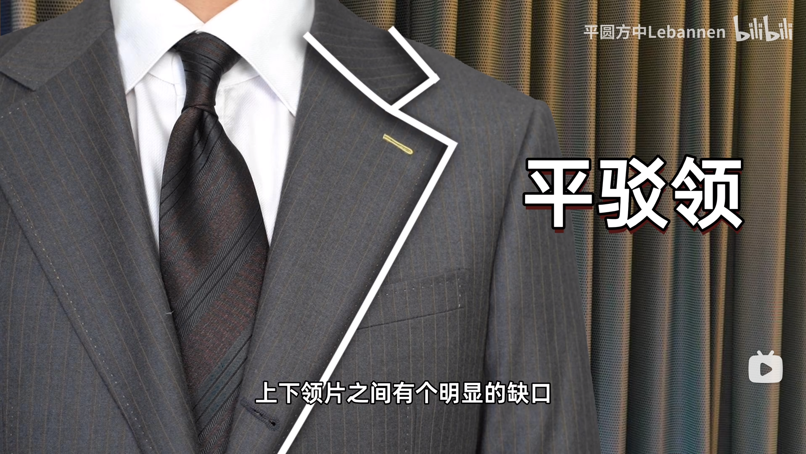
 
戗驳领（提升气场，礼服）
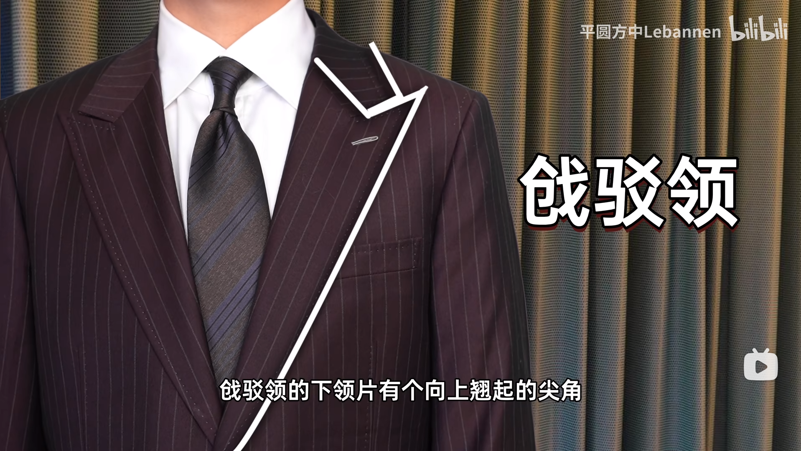
 
青果领（窄青果领精致，宽青果领有气场。休闲，礼服，吸烟袍）
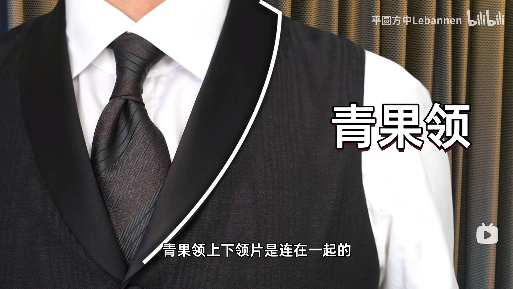

### 扣型

**单排扣**的扣子的多少会影响V区的大小，越短的V区视觉效果越复古。
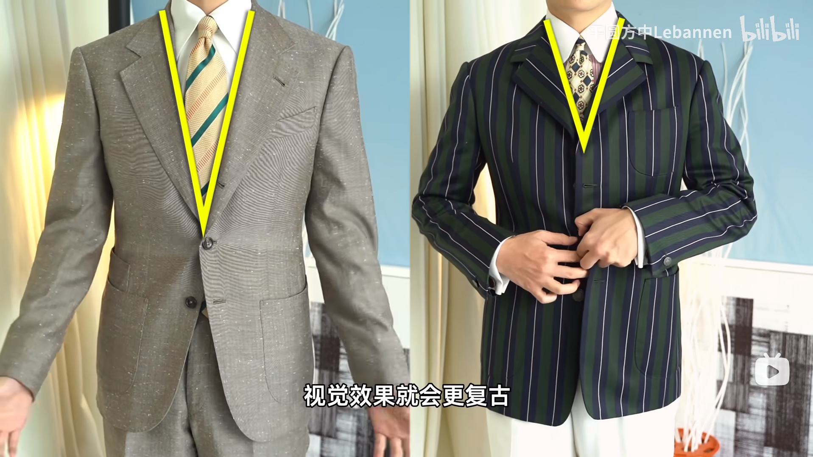

而**双排扣**的扣子越多约有制服感，越少越随意、休闲。
^5c6154

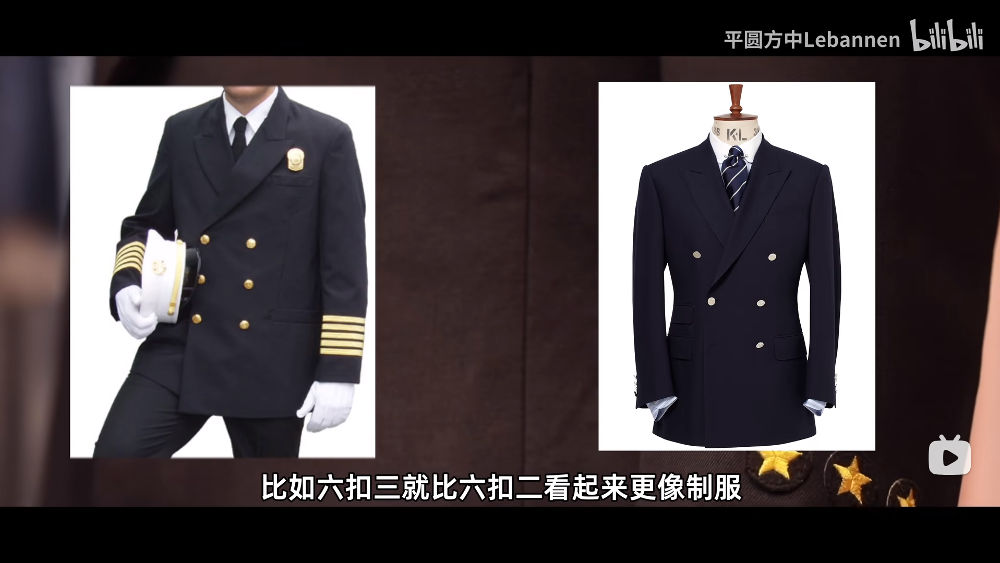

## 按正式度分

依次递减

### 礼服
#### White tie

燕尾服（黑色戗驳领，前短后长，前身敞开，身后两粒纽扣装饰，配带蝴蝶结的黑色漆皮歌剧院鞋）、

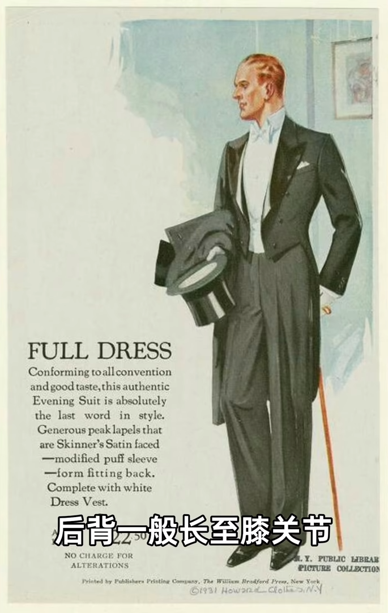

晨礼服（炭灰面料，戗驳领，单排一粒扣，前后长短平滑过渡）

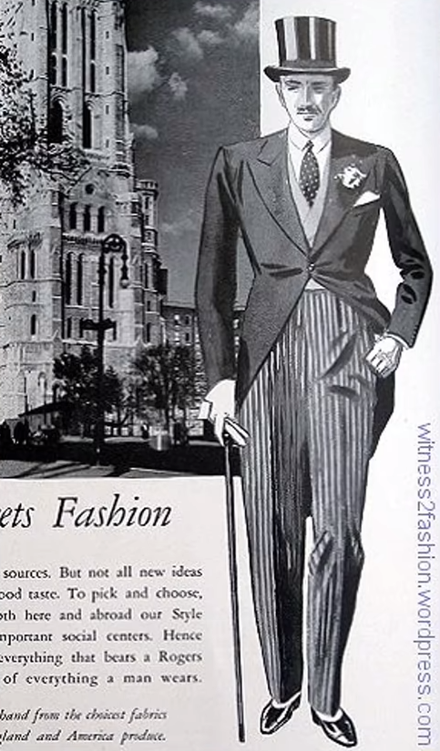

梅斯礼服（Mess jacket，起源于军队短礼服，没有尾巴的燕尾服）

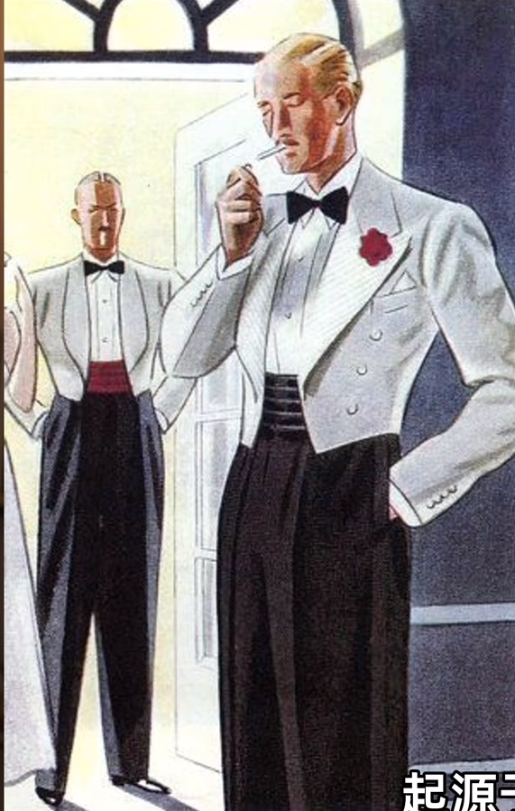

#### Black tie
例如颁奖晚会、婚礼典礼

Tuxedo（塔士多礼服，黑色，戗驳领、青果领，）

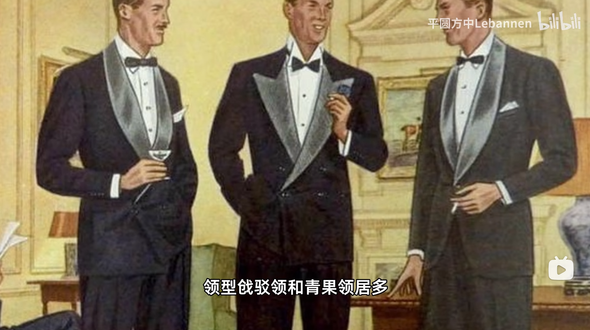

吸烟装（源于印度居家袍，青果领）

### Business formal(商务正装)

商务三件套（外套马甲裤子，藏青深灰，更适合敞开前身）

例如董事套装（没有长后摆的晨礼服，灰色最正式，也有别的颜色的）

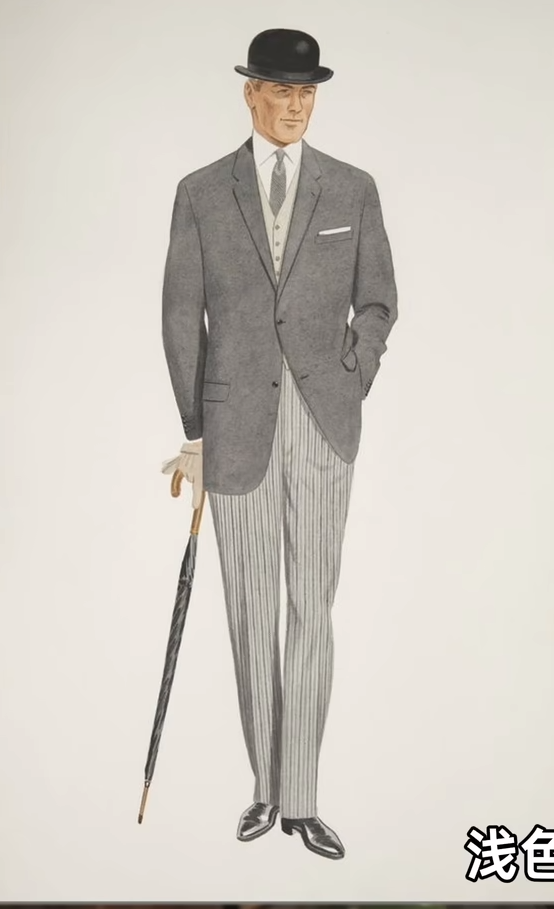

商务两件套（外套裤子，藏青色、深灰色）
^975350

> [!warning]
>严格意义上说纯黑色西装只有在婚礼或葬礼中用，深炭灰色或深藏青色不算纯黑
> 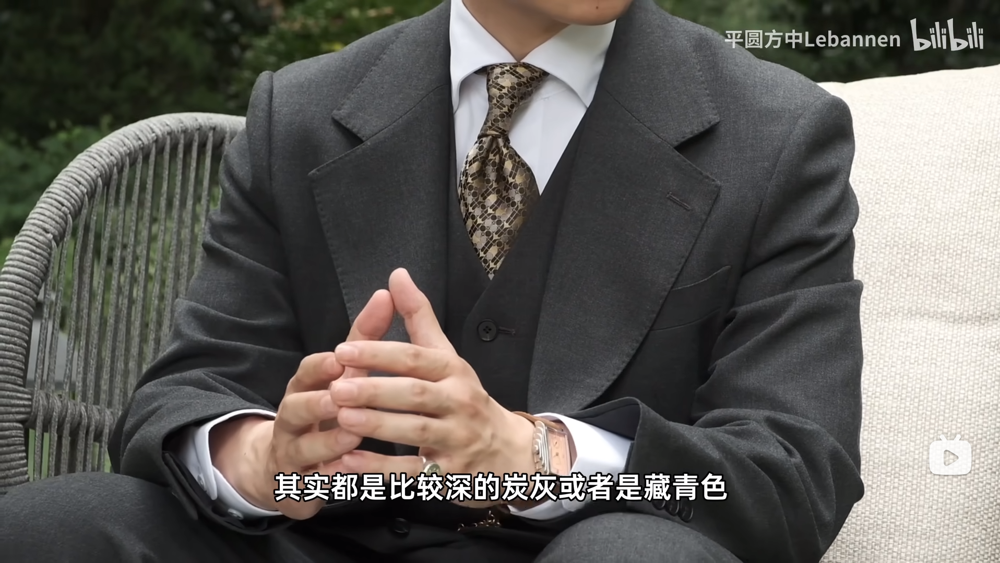

### 休闲

一般上下颜色不同

Navy blazer（海军蓝布雷泽+异色下身）
> [!note]-
> Navy blazer的不同搭配可以适用于从休闲到礼服的各种正式度场合，适合作为新手入门款绅装。另外，[[#^5c6154|金属材质的双排扣]]也证实着它的海军制服起源，也有改为白扣的现代化改良。

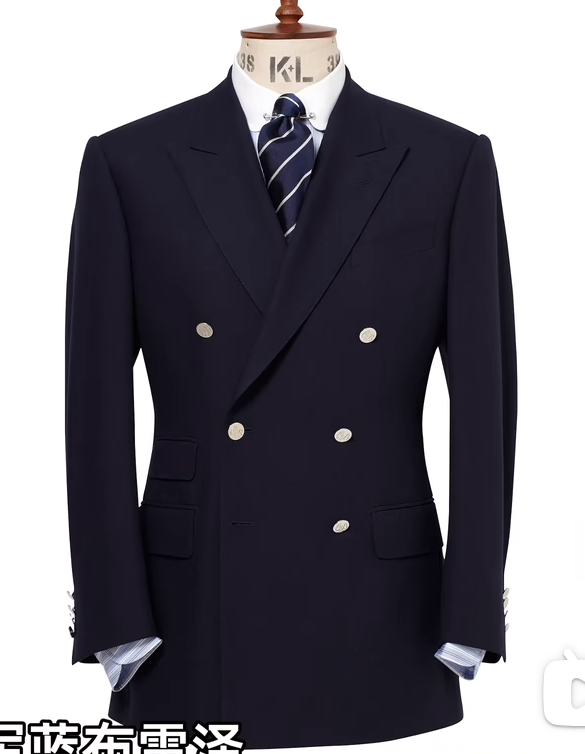

Blazer（起源于一款颜色火红(blaze)的赛艇俱乐部队服，宽条纹面料(赛艇俱乐部面料)，后来也有镶白线的，DK制服的起源）

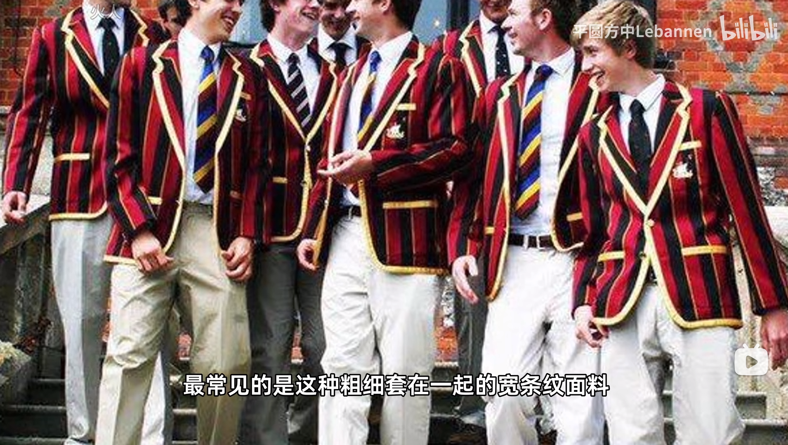

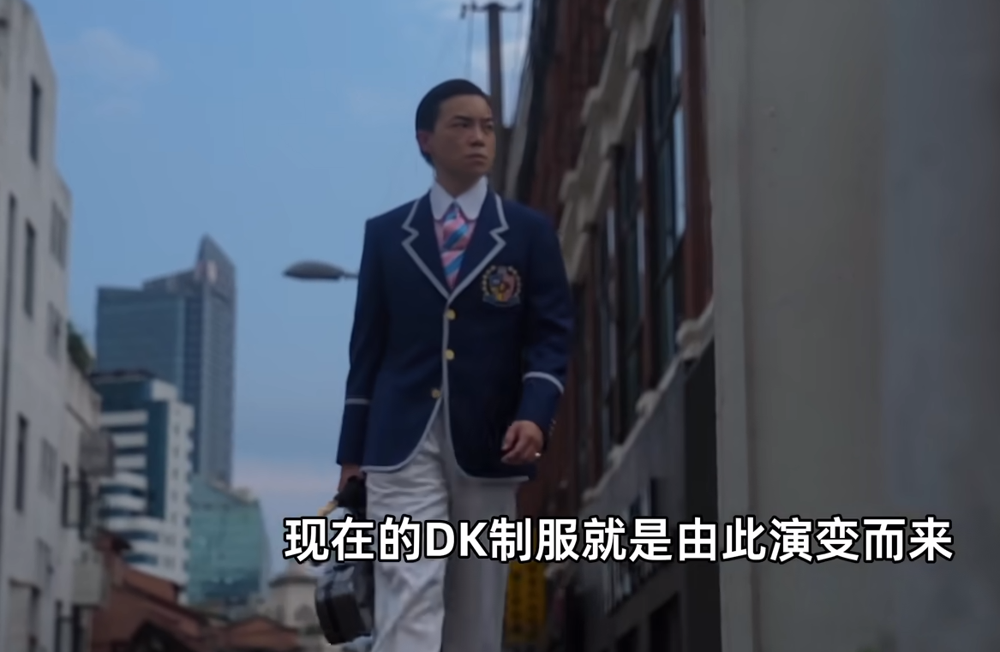
> [!info]- 日本学生缩写
> JS -> JC -> JK -> JD

猎装（轻薄，浅色为主）包括游猎夹克、射击夹克、诺福克夹克

# Fabric and Craft

绵羊毛是最常用的纺织物

**面料价格**：化纤仿羊毛(TR)<化纤羊毛混纺 <纯羊毛<羊毛天然纤维混纺<羊绒(山羊的)<高支纯羊毛(很细的毛)<稀有动物毛

胸衬工艺最贵

**胸衬工艺价格**：粘合衬(粘一个硬的衬布)<半麻衬<全麻衬，机器<手工

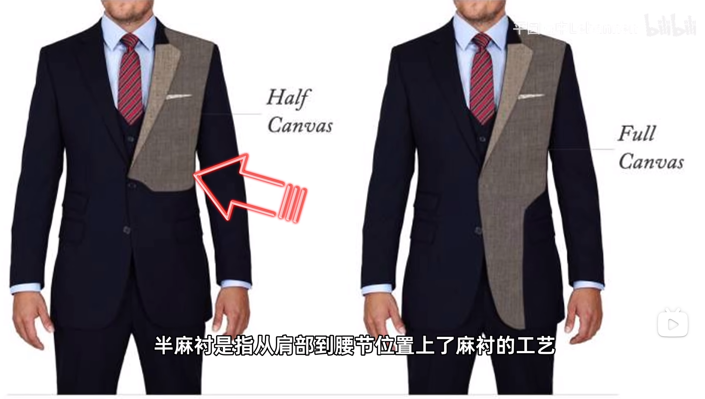

机器纳衬不如手工纳衬，后者调控更精细

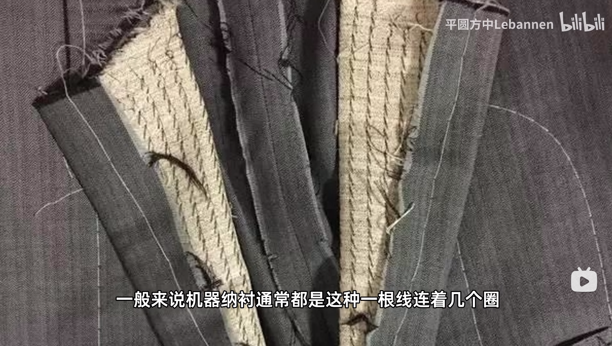
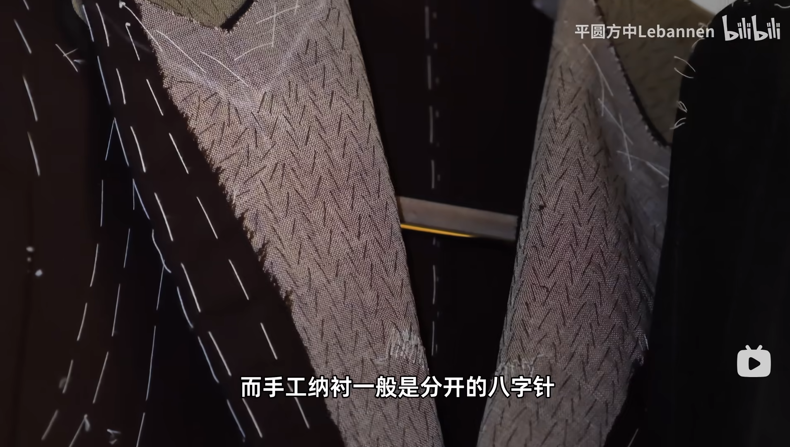

# 合身
仅供参考

核心观点：
1. 肩宽
2. 腰细
3. 腿长直
4. 无乱七八糟的褶皱

细节：
1. 肩宽上既不要有束缚感又不要超过单侧 2 cm
2. 如果腿短，站直时下摆贴裤子好，否则会吸引目光显得腿从那里才开始，显腿短
3. 如果腿短，下摆要将臀部盖住，让人不知道腿的起点。再加上收腰暗示腰围就显腿长了
4. 自然下垂时袖子盖住手腕骨节且不超过虎口上方 2 cm
5. 领口和脖子要贴和
6. 整件衣服不要有过多褶皱
7. 腿型不好且腿短就选宽松高腰裤吧，笔直的裤线可以引导视觉。
8. 裤长太短会露出脚踝造成视觉不连续，且现腿短。而裤子太长会导致在鞋子上堆起褶皱。最好的长度是前面盖住鞋面又不堆叠，后面盖住皮鞋后跟的皮面的一半。所以其实是前短后长的，这就是所谓“马蹄口”。

# 购买渠道

## 衣服
1. 古着：便宜
2. 中范 Cultum
3. 平圆方中
4. 澜外：主理人是@石头的穿衣报告
5. Ugentle
6. ENPofficial

## 鞋子
1. 壹植鞋履
2. 青润：经典入门三接头牛津鞋

# 扩展阅读

1. 西装客公众号：大量知识
2. 王骁：学院风
3. 石头的穿衣报告：硬汉风
4. Mr. dandy：点评明星艺人的服装
5. 思远：穿搭
6.  朱芝士Neo：绅装+汉服

# Reference
https://www.bilibili.com/video/BV1iM4m1m76f