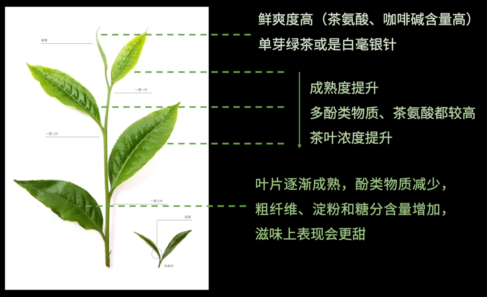

---
tags:
  - beverage
  - skill
---

# 原料

Source: https://www.bilibili.com/video/BV1x2421Z7kC

常见茶的茶树有两个亚种
- 中华亚种(Camellia sinensis, var. sinensis)：俗称小叶种，种植面积最大的茶种，香气高扬、滋味柔和
- 阿萨姆亚种(Camellia sinensis, var. assamica)：俗称大叶种，滋味浓强，内含物质多，分布于云南、印度、斯里兰卡等

> [!example]
祁门红茶是小叶种，香味足；滇红则是大叶种，香气不突出，但耐泡。

并非越嫩越好，例如白茶寿眉就是一芽三四叶的。

# 分类

是中国的分类体系，也是ISO标准

（按照发酵与氧化程度由浅入深排列）
- 绿茶（清香、花香、栗香）：龙井、竹叶青、六安瓜片、普洱生茶
- 白茶（毫香、花香）：各种带有白茶后缀的短语
- 黄茶（清香、天香、锅巴香）：蒙顶黄芽
- 青茶（兰香、蜜香、花果香、木香、焦香）：即乌龙茶，铁观音、岩茶、东方美人
- 红茶（甜香、花果香）：正山小种、祁红
- 黑茶（陈香、木香、菌花香）：普洱熟茶、安化黑茶

> [!warning]
安吉白茶是绿茶，只是因为其茶树是白化种“白叶一号”。

# 冲泡

浸出原理和[[Coffee]]类似

味道越偏苦(咖啡因与茶多酚)<-茶水比越大、茶叶越细嫩、水温越高、出汤时间越晚

## 参考

祁门红茶：茶水比1:20到1:30，90度，前三泡5s内出汤。颜色橙黄透亮，有香味。
