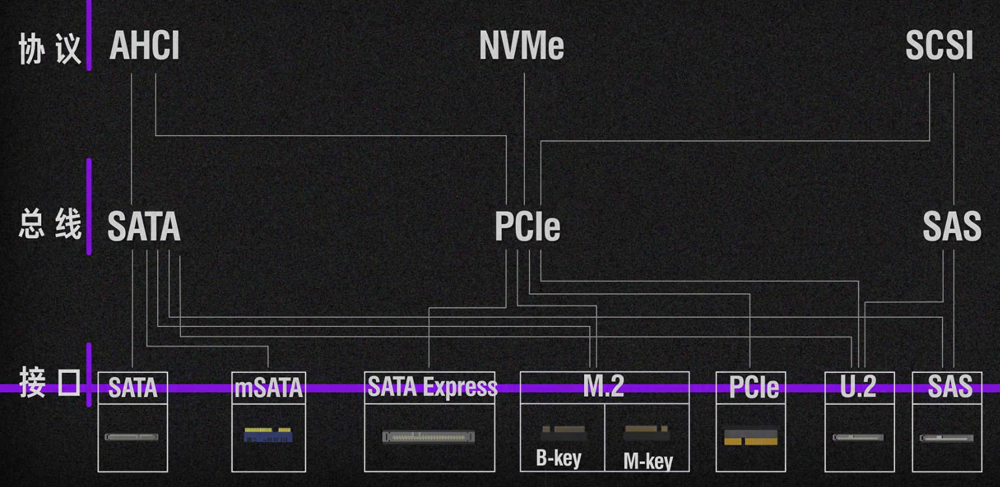

## CPU

Vdroop: The vcore difference when CPU transits from **idle** (low current) to
**load** (high current). Load Line Calibration alleviate this.

Vdrop: The vcore difference between the expected (which can be set in BIOS) and
the real (which can be checked in CPU-Z) due to internal persistence of power of
supply or regulator, as well as voltage drop across intervening wiring or
components.

VID: default vcore CPU requests its motherboard for. It has a table to ask for
different voltage when in different load. The lower VID is, the more potential
to overclock.

## USB

### Interface

**Type-A**, Type-B, **Type-C**, Mini-A, Mini-B, Micro-A, **Micro-B(aka. micro USB)**, e.t.c

Version: check [USB wiki](https://en.wikipedia.org/wiki/USB#Connector_type_quick_reference)

Difference between xHCI and USB protocol:
```
Linux USB Core
       ↓
xHCI Host Controller Driver (xhci_hcd)
       ↓  xHCI Specification
USB Host Controller
       ↓  USB Specification
USB Cable, USB Hub, USB Devices
```

## Disk



1. Command set / protocol: e.g. Read logical block 1000; flush the cache; get SMART information
    - ATA / ATAPI: used by PATA and SATA devices
    - NVMe: used by modern PCIe SSDs
    - SCSI: used by SAS and many enterprise/storage transports
2. Host controller interface: e.g. how to set the address of command slots and data cache; how to support DMA
    - AHCI: common host controller interface for SATA
    - NVMe driver: host software interface for NVMe controllers
    - SAS HBA / RAID driver: host interface for SAS devices
3. Transport / interconnect: e.g. connect the host controller and the physical interface
    - PATA: obsolete parallel ATA transport
    - SATA: serial ATA transport
    - PCIe: high-speed serial interconnect, used by NVMe SSDs
    - SAS: serial attached SCSI transport
4. Physical interface / form factor:
    - SATA connector
    - mSATA
    - M.2
    - U.2
    - PCIe add-in card
    - SAS connector

Note: AHCI is not a hardware; it's an interface.

**Data read of AHCI+SATA**:
1. The OS file system generates a read request.
2. The AHCI driver generates an ATA `READ DMA EXT` command.
3. The driver writes the ATA command FIS(Frame Information Structure) into the command table in RAM.
4. The driver writes the data buffer address, for example `0x80000000`, into the PRDT.
5. The driver writes to the AHCI registers to start a specific command slot.
6. The SATA controller reads the command header from RAM.
7. The SATA controller uses the command header to locate the command table.
8. The SATA controller reads the ATA command FIS from the command table.
9. The SATA controller sends the ATA command to the drive as a SATA FIS.
10. The drive returns the data.
11. The SATA controller writes the data to `0x80000000` using DMA.
12. The SATA controller triggers an interrupt to notify the CPU that the operation is complete.

**Data read of NVMe+PCIe**
1. OS read request
2. NVMe driver creates NVMe Read command
3. command is placed into Submission Queue in RAM
4. driver rings SQ doorbell
5. NVMe SSD fetches command over PCIe
6. SSD reads NAND
7. SSD DMA-writes data into host RAM
8. SSD writes Completion Queue entry
9. SSD raises MSI-X interrupt
10. driver consumes completion.

**NVMe+PCIe vs. AHCI+SATA**: NVMe over PCIe provides higher bandwidth, supports many more queues with deeper queue depths, and incurs lower protocol overhead.

## Signal

ref: [this video](https://www.bilibili.com/video/BV1Y3mTYvEz1)

## Headset Jack

TS, TRS(Tip, Ring, Sleeve) and TRRS.

In CTIA(modern) standard, TRRS: L/R/GND/MIC (corrspond to T/R/R/S). Similarly, TRS: L/R/GND. Therefore, TRS headphone plug inserted into a TRRS jack usually works for listening. But a TRS microphone plug inserted into a TRRS headset jack often does not work because the laptop is expecting the microphone signal on the last contact of TRRS.

In OMTP(obsolete) standard, TRRS: L/R/MIC/GND.

## Useful commands on Linux
[[basic_operations#Hardware]]

