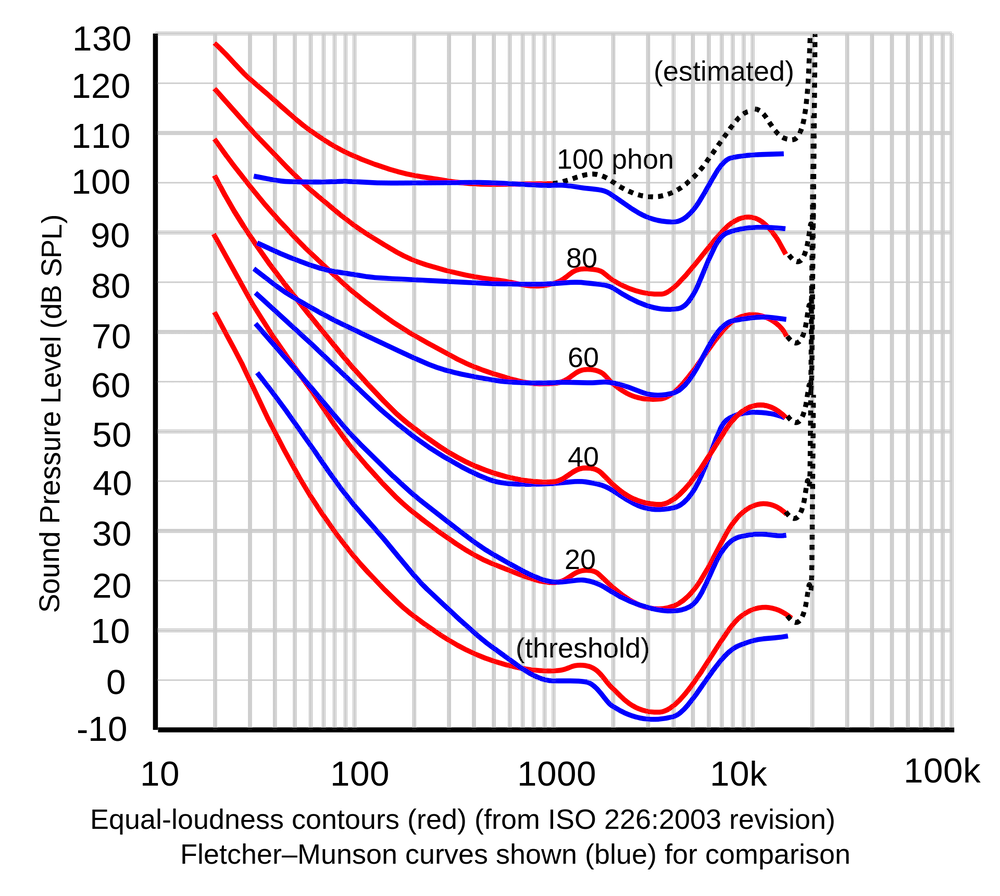

## Software

PipeWire's [parametric EQ](https://docs.pipewire.org/page_module_filter_chain.html) chains a number of biquads together. But biquads introduce nonlinear phase response as shown [here](https://thesofproject.github.io/latest/algos/eq/equalizers_tuning.html). It is recommended to use FIR (Finite Impulse Response) instead of IIR (Infinite Impulse Response).

`$HOME/.config/pipewire/pipewire.conf.d/custom.conf` :
```conf
context.properties = {
  default.clock.allowed-rates = [ 44100 48000 88200 96000 176400 192000 352800 384000 ]
}

stream.properties = {
    resample.quality = 10
}
```

## Harman's curve

- The in-room steady-state magnitude frequency response curve is measured in a listening room with reflections, while an anechoic chamber frequency response only captures the direct sound.  
- For speakers with a flat on-axis frequency response curve in an anechoic chamber, the steady-state curve in a typical listening room exhibits a gently declining curve (1dB/octave) from low to high frequencies.  
- Harman target curves are a series of curves, like Harman over-ear 2018 and Harman in-ear 2019 target curves.
- First, the steady-state magnitude frequency response of the speaker in the Harman reference listening room is adjusted to be flat. However, listeners generally perceive this sound as having too much high frequency. Subsequently, through extensive double-blind listening tests, listeners adjusted the levels of low and high frequencies based on their preferences, ultimately resulting in a target in-room curve (in-room steady-state frequency response) that most people preferred—this is the **Harman room curve**(the frequency response measured near the head rather than at the eardrum
). Interestingly, this curve closely resembles the steady-state curve naturally exhibited by high-quality speakers with a flat frequency response measured in an anechoic chamber when placed in a typical room.
- The core objective of the **Harman headphone curve**(the frequency at the eardrum response measured rather than near the head) is to use headphones to simulate the experience of listening to a pair of high-end speakers in an acoustically excellent room.
- The difference of a Harman headphone curve and a Harman room curve is a Head-Related Transfer Function(HRTF).

## Weighting

A-, B-, and C-weighting are frequency-weighting curves used in sound-level measurements to approximate the frequency sensitivity of human hearing at 40 phon, 70 phon and 100 phon.

> [!note] phon
> If a sound is perceived to be as loud as a 1kHz pure tone at L dB SPL(Sound Pressure Level), then its loudness level is L phon.



A-weighting has a higher low-frequency damp than B-weighting and C-weighting because human hearing is less sensitive to low frequencies at a lower loudness level.

## EQ

In depth articles: https://www.reddit.com/r/oratory1990/wiki/index/knowledge_posts/  

Useful EQ presets
- https://www.reddit.com/r/oratory1990/wiki/index/list_of_presets/
- https://peqdb.com/
- https://squig.link/

Useful measurements
- https://huihifi.com
- https://reference-audio-analyzer.pro/en

#### Q&A

1. 调音师早就帮你调好了，还需要你自己eq吗？调音师是物理调音，难度比eq高很多，经常牵一发而动全身。DSP调音会方便很多。事实上，现在有一些耳机干脆直接自己集成电路进行DSP调音了，例如airpods pro的自适应均衡。有先进工艺何必再执着于调音仙人传统手艺？除非是将耳机当作奢侈品。
2. 为什么不自己测曲线？前提是你有隔音室或至少是安静的房间、人工耳与高精度的微型拾音器。
3. 为什么不是一个产品一个预设而是一个耳机一个预设？因为即使同一款耳机，也会有方差，尤其如果品控一般，例如[这里](https://zhuanlan.zhihu.com/p/1889705136332443687)展现了6个shp9500耳机的频响曲线。此外，耳机在生产后，如果结构没有大的损坏，例如耳罩掉了（虽然用久了耳罩磨损是不可避免的，至少我两年前买的一个皮质耳罩的耳机已经出现磨损了），以人耳的灵敏度，频响曲线几乎没有区别，参见[此文](https://www.headphonesty.com/2025/07/science-ear-pad-burn-changes-headphones-sound/)（由此也可见煲机是玄学）。[这里](https://zhuanlan.zhihu.com/p/75482749)总结了一些人耳的听力极限。
4. 为什么这么重视频率响应？因为这是所有指标中与听众偏好最相关的（参见[此文](https://aes2.org/publications/elibrary-page/?id=5270)），至少比价格更相关（见[此文](https://doi.org/10.1121/1.4984044)，除非是出于越贵越好的心理暗示）。
5. 照你这么说我可以通过调音让9.9原道秒大奥？不是。频响曲线是在输入稳定的环境下测的，既不反映耳机对模电的响应速率也不反映失真率。但当中高端耳机的本身的体质足够好的情况下，对人耳而言它们唯一的区别就是频响曲线。顺便一提，通常耳机在低频的THD+N会更高，所以强行拉高低频表现差劲的耳机的低频响应曲线可能导致整体更大的失真率，反而导致听感下降，这是需要权衡的。
6. EQ会引入失真吗？EQ有不同的算法实现，如果使用IIR，则会引入相位失真(即，不同频率的波的群延时不同)，但人耳对此并不敏感（虽然人耳对左右耳音频的相位差异是比较敏感的，但你会左右耳用不一样的滤波器吗？），只有在短时波包中人耳才有感知到区别，例如鼓点，参见[此文](https://www.researchgate.net/publication/247027642_On_the_Audibility_of_Midrange_Phase_Distortion_in_Audio_Systems)；而采用线性相位滤波器则不会引入相位失真。
7. 为什么要追求这样的target？我听着好听不就行了？事实上这是两条路，一条是追求自己觉得好听；另一条路是寻求高保真，尊重原著，希望自己听到与音频制作者一样的内容。对于前者，实际上你就是在购买厂家的调音，那么你不设置eq即可，没有什么损失。对于后者，如果混音师使用的是正规的工作室，那么他的配置应该是直达声是平直响应的监听音箱与一个接近哈曼参考值的听音房间。那么耳机的目标就是在给定与调音师使用的一样的音频信号时重建调音师在听音房间中的耳蜗处的声场。这是有相对明确的标准的，而我们的target就是在追求这个标准，具体可见[此文](https://peqdb.com/wiki/PEQdB-White-Paper.pdf)。当然，如果混音师师考虑到自己的听众的听音设备低频缺失高频无力或自己的监听就不行，就会主动调味，那反而会导致在target下味道过重，在一些流行音乐中确实存在这样的现象。
