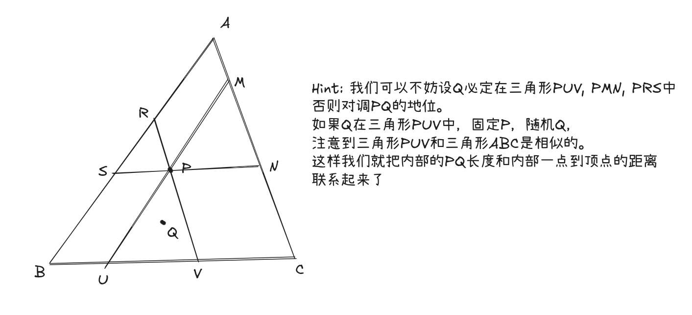

在国际象棋盘上每个格子中间放一粒米，最少切多少刀才能将这些米两两分开？

> [!info]- Answer
> 注意到两粒米能够分开当且仅当它们所连成的线段中间被切过一刀，这意味着最外一圈的米所连成的正方形上至少有28道刀痕，而一刀至多产生两个刀痕。

---

n人围成一圈，从第一个人开始传球，均匀随机传给左右的人，求最后一个首次被传到的人的分布。

> [!info]- Answer
> 除了第一个人一开始手上就有球，其它n-1个人最后一个被传到的概率相同。对于任何一个人，他作为最后一个被传到的人的概率=P(球首次被传到他左边的人)*P(球绕一圈传到他右边的人)+P(球首次传到他右边的人)*P(球绕一圈传到他左边的人)=P(球绕一圈传到第一个人右边的右边的人手里)。因此这些概率都是一样的。https://math.stackexchange.com/questions/116446/random-walk-on-n-cycle

---

三角形ABC中随机取两点P与Q，求证$E[PA+PB+PC]=5E[PQ]$

> [!info]- Answer
> 

---

- 一个圆的内部是否可能被一个圆族不重不漏地覆盖？

> [!info]- Answer
不能。每次在一个圆$O_i$内部取经过其圆心的圆$O_{i+1}$，则$O_{i+1}$半径小于等于$O_i$的$\frac 12$。这构成了一个大小趋向于0区间套，设其极限为$K$，考虑过$K$的圆，必定与区间套相交。

- 一个圆内部能否被一个开圆盘族不重不漏地覆盖？

> [!info]- Answer
不能。否则这个圆可以被表示为两个非空且互不相交的开集的并集，违反了连通空间的定义，而道路连通空间一定是连通空间

- 一个圆内部能否被一个闭圆盘族不重不漏地覆盖？

> [!info]- Answer
不能。假设 $U = \bigcup_{i=1}^\infty D_i$，且所有 $D_i$ 为互不相交的闭圆盘。定义一个剩余集合 $X$，它由所有不在任何圆盘“内部”的点组成：
$$X = U \setminus \bigcup_{i=1}^\infty \text{int}(D_i)$$
，则 $X$ 在 $U$ 中是一个闭集且有
$$X = \bigcup_{i=1}^\infty (X \cap \partial D_i)$$
应用贝尔纲定理：因为 $X$ 是一个完备的度量空间，且被可数个闭子集 $(X \cap \partial D_i)$ 覆盖，那么至少存在某一个圆周边界 $\partial D_k$，它在 $X$ 中拥有非空的内部，矛盾。

---

下面的讨论均在整系数多项式中。任意$f(x)$是否必定存在$g(x)$使得$f(g(x))$不为既约多项式
> [!info]- Answer
$f(x) | f(f(x)+x)$

---

平面上分布着10个不同的点，你需要用若干个单位圆来覆盖它，并且圆与圆之间不能重叠。 求证：不论这10个点如何分布，你总能找到一种方法使得这些圆可以覆盖全部这10个点

## Famous Puzzles

- https://en.wikipedia.org/wiki/Four_glasses_puzzle
- https://www.reddit.com/r/puzzles/comments/st0b70/find_the_fake_among_12_balls_in_3_weighs_all_12/
- https://en.wikipedia.org/wiki/Knights_and_Knaves : 面前有两个人，一个天使一个恶魔，恶魔总说假话，天使总说真话，前面有两扇门，一扇天堂一扇地狱。你能向面前两个人中的一个问一个问题，但你不知道你问的那个人是天使还是恶魔。怎么识别出哪扇门是天堂？
