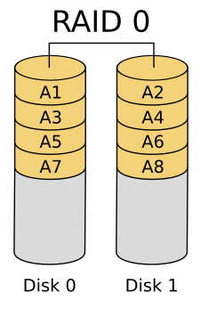
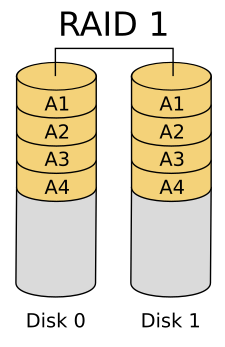
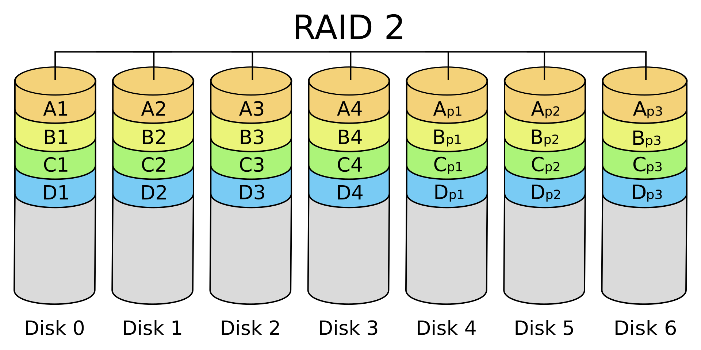
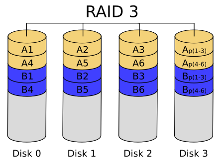
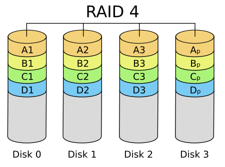
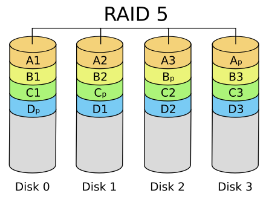
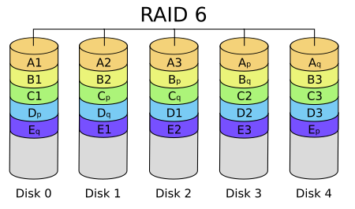
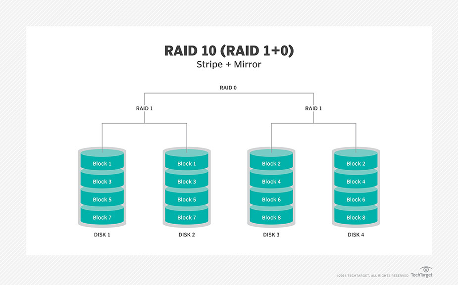

---
tags:
  - raid
  - storage
  - linux
  - tutorial
aliases: []
id: raid_tutorial
---

# Operation
## pre
check bad blocks: https://wiki.archlinux.org/title/badblocks
## setup
https://www.slashroot.in/how-configure-raid-level-5-linux
https://www.slashroot.in/software-raid-1-configuration-linux
## remount /home
1. temporary mount raid
2. copy /home to the temporary endpoint
3. [auto mount raid](https://askubuntu.com/questions/164926/how-to-make-partitions-mount-at-startup/165462#165462)
4. restart
## check health
1. https://www.ionos.com/help/server-cloud-infrastructure/dedicated-server-for-servers-purchased-before-102818/rescue-and-recovery/software-raid-status-monitoring-linux/#:~:text=You%20can%20read%20the%20status,command%20cat%20%2Fproc%2Fmdstat.
2. https://serverfault.com/questions/1056047/how-can-i-know-if-one-disk-faults-on-raid-5
## renew
https://www.thegeekdiary.com/replacing-a-failed-mirror-disk-in-a-software-raid-array-mdadm/

# Levels

**RAID 0**: Striped set. No redundancy

**RAID 1**: Exact one mirror

**RAID 2**: Obsolete. Bit-level striping. Hamming code. Disks are synchronized.

**RAID 3**: Rarely used. Byte-level striping. Parity code. Disks are synchronized.

**RAID 4**: Block-level striping. Parity code.

**RAID 5**: Block level striping. Distributed parity(evens out the stress of a dedicated parity disk).

**RAID 6**: Same as RAID 5 except for the additional parity block.

**RAID 10**: RAID 1 + RAID 0

