---
tags:
  - geography
aliases: []
id: rock
---

岩石的酸性基性是指岩石中二氧化硅（SiO₂）含量的相对高低程度

> [!question]- 为什么叫酸性基性？
> 因为19世纪的化学家发现高SiO₂的岩石在熔融或风化时能生成硅酸。不过当代岩石学更倾向使用 **“长英质”（felsic）** 和 **“镁铁质”（mafic）** 替代“酸性”“基性”，直接反映矿物组成（长石/石英 vs. 铁镁矿物）

| 分类                   | SiO₂含量(%) | 代表性矿物         | 侵入岩（深成岩） | 喷出岩（火山岩） | 颜色指数 |
| ------                 | ----------  | ------             | -------          | ----------       | ------   |
| 超基性岩（超镁铁质岩） | <45         | 橄榄石、辉石       | 橄榄岩           | 科马提岩         | >90      |
| 基性岩                 | 45-52       | 辉石、基性斜长石   | 辉长岩           | 玄武岩           | 40-90    |
| 基性-中性过渡岩类      | -           | -                  | 正长岩           | 粗面岩           | -        |
| 中性岩                 | 52-66       | 角闪石、中性斜长石 | 闪长岩           | 安山岩           | 15-40    |
| 酸性岩                 | >66         | 石英、钾长石、云母 | 花岗岩           | 流纹岩           | <15      |

> [!info] 颜色指数
描述火成岩中暗色矿物（铁镁质矿物）含量的数值指标，通常以体积百分比表示

> [!warning] 酸碱性与硬度
> 没有绝对的关系。石英（酸性岩标志矿物）硬度7，反而比橄榄石（超基性岩主矿物）更硬，但长石类矿物（6-6.5）拉低了整体酸性岩硬度。

> [!question]- 为什么闪长岩与安山岩颜色不一样
生成[[Diorite|闪长岩]]与[[Andesite|安山岩]]的岩浆成分相近，不过深成岩闪长岩是在地底冷却后形成的，而安山岩则喷出了地面。因此闪长岩的冷却过程更缓慢，有利于角闪石（深色）与斜长石晶体（浅色）的形成，于是其黑白对比度就比较大；而安山岩冷却更快，黑白对比度更小。而介于两者中间的还有浅成岩闪长玢(bīn, 指玉的纹理或花纹)岩 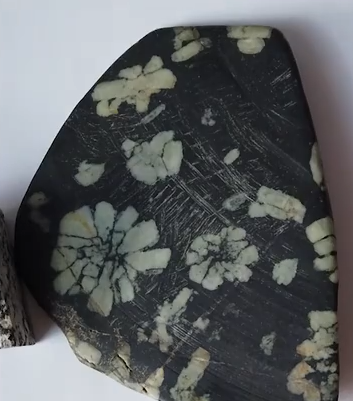与超浅成岩安山玢岩。(超深成岩->超浅成岩) 参考[这个视频](https://www.bilibili.com/video/BV1sg411N7TM)

**Bowen's reaction series** 描述了不同的石头是怎么生成的。

## 常见岩石

方解石就是碳酸钙

## 硬度

1-10: 滑石方萤磷，正英黄刚金

常见物品硬度：铅笔芯（1），指甲（2-2.5），铜币（3），铁钉（4-4.5），美工刀（5.5）、玻璃（5.5）、钢锉刀（6.5）、沙子（7）、

## 身边岩石

花岗岩，英国棕
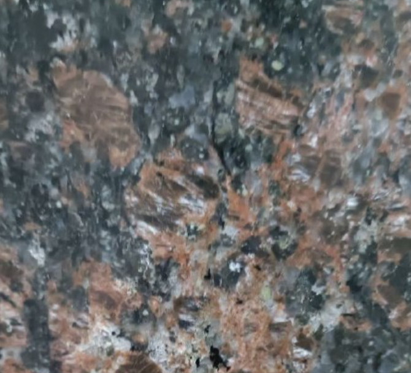

不是岩石，是抛釉瓷砖（Glazed Polished Tile）
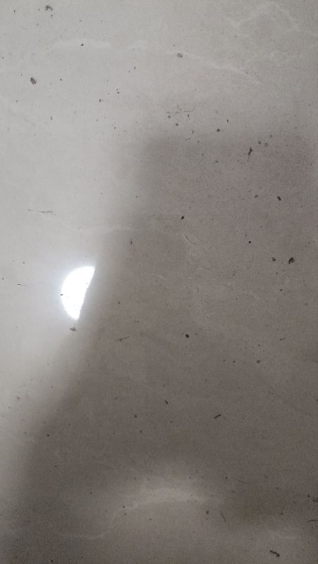

花岗岩，荔枝面黄金麻
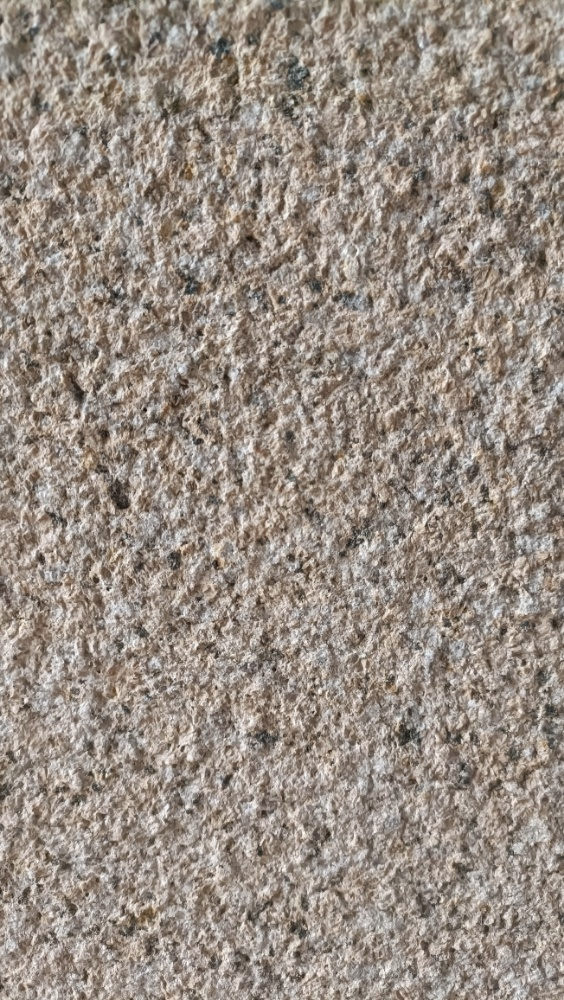

花岗岩，芝麻灰
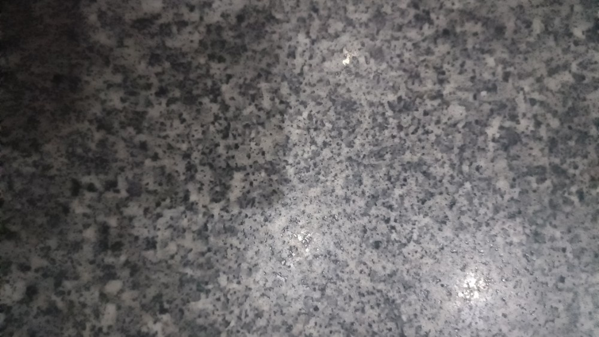

水磨石，骨料为白云岩，基质为水泥
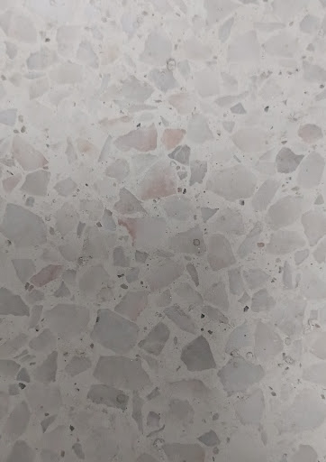

花岗岩
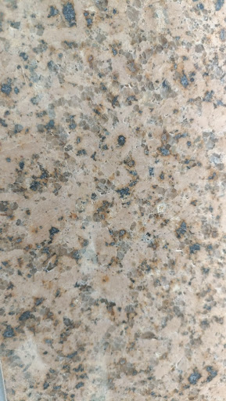

不是天然岩石，水洗石，小石子凸出基质
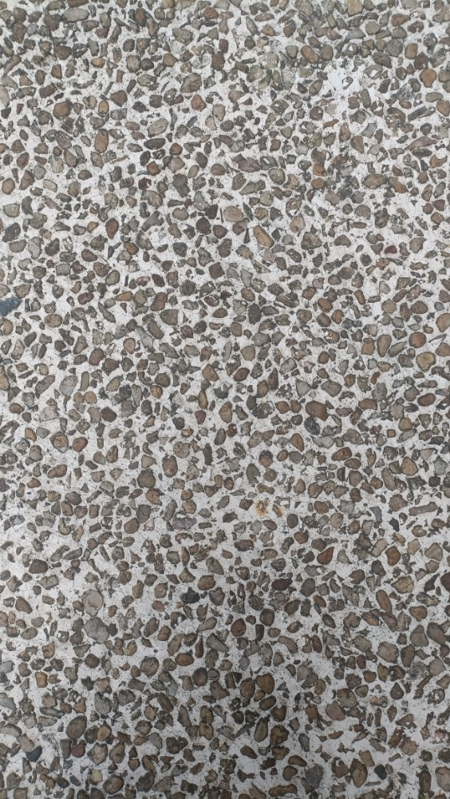

含磁铁矿的致密玄武岩，隐晶质，比重2.94
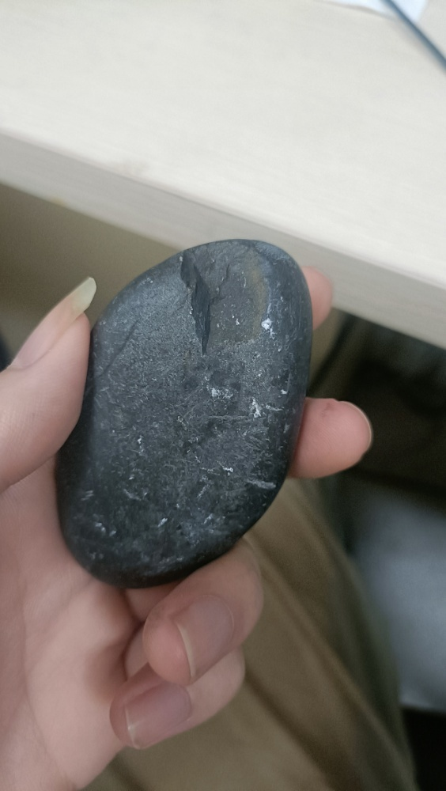

杏仁状玄武岩，玉髓填充
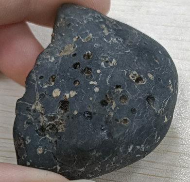
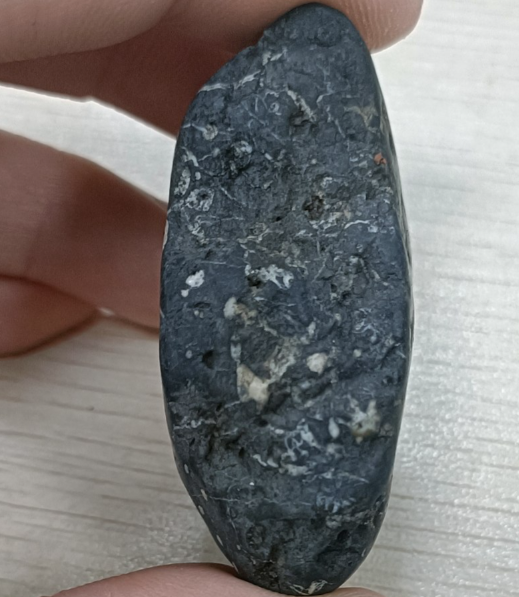
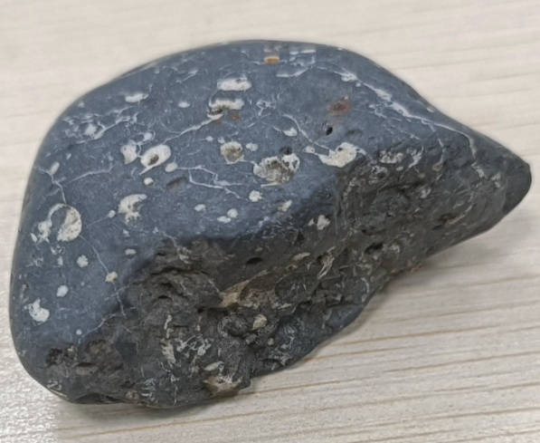

表面有一层碳酸钙的致密玄武岩
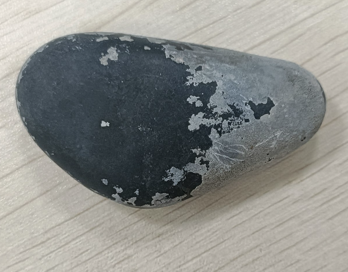

条带状角岩，比重2.69，不规则断口；断面没有光泽，因此不是BIF；不会沿着平行方向断裂，因此不是硅质板岩；它和玄武岩混在一起，因此更有可能是角岩；100x显微镜下没有看到明显的定向晶体结构，因此条带不是受力变质产生的，而是本来的条带状角岩的条带是原岩的沉积层理的变余构造，黑色条带可能反映了当时的还原环境。
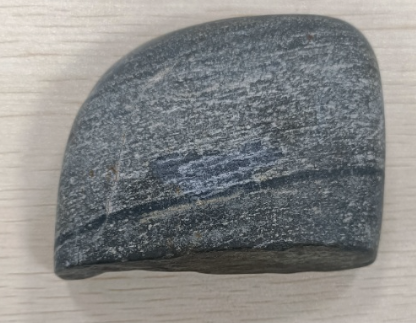
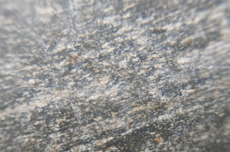
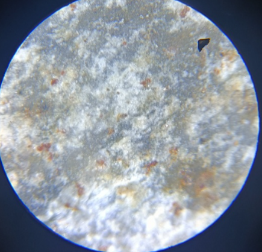 可见锈色斑点
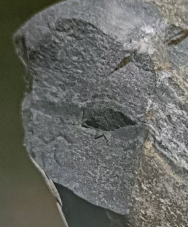

石英岩，比重为2.54，褐铁矿化风化外皮，黄褐色条痕，有溶蚀孔
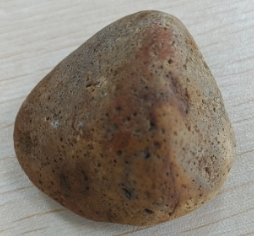
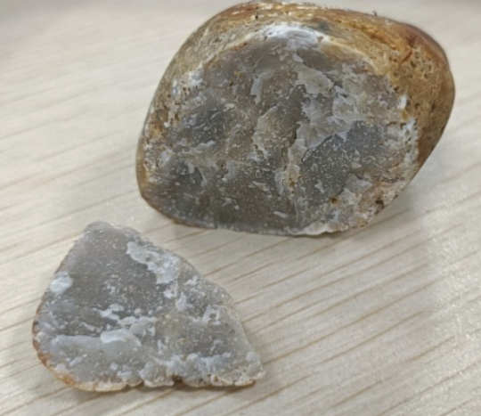 很标准的新鲜断面，和[这个](https://geology.com/rocks/quartzite.shtml)一样

燧石岩，比重2.63很接近石英族矿物的标准理论比重(2.65)。没有沉积层理，因此可能是燧石结核上崩落下来的风化后的残块。
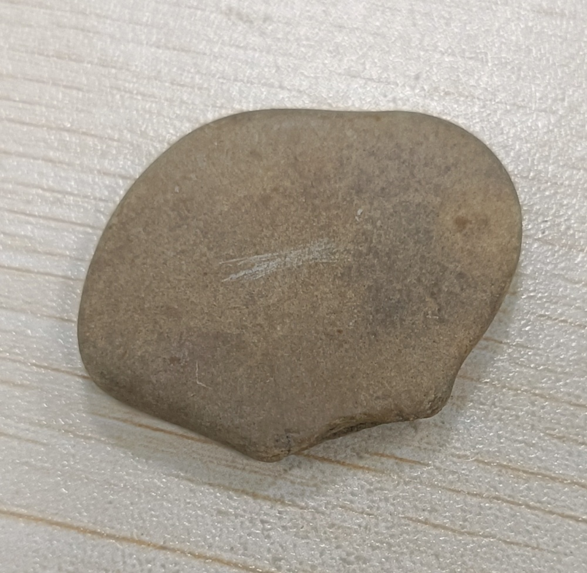
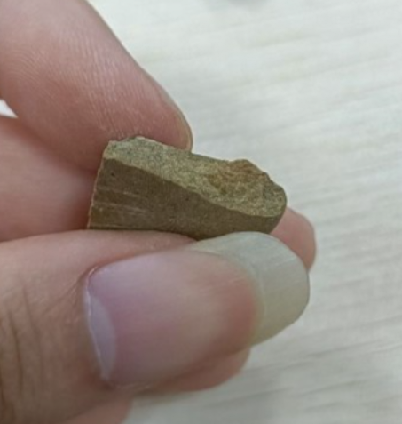

辉长岩，浅色部分为斜长石，深色部分为辉石
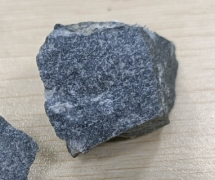
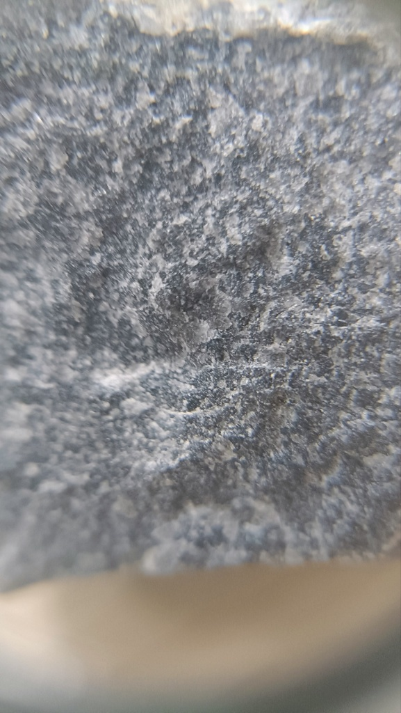
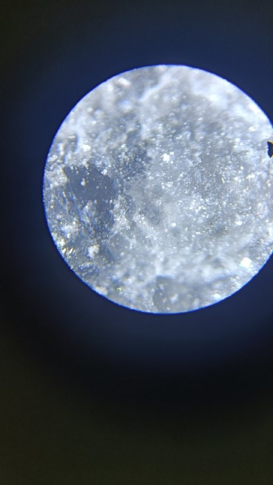

### Unknown

