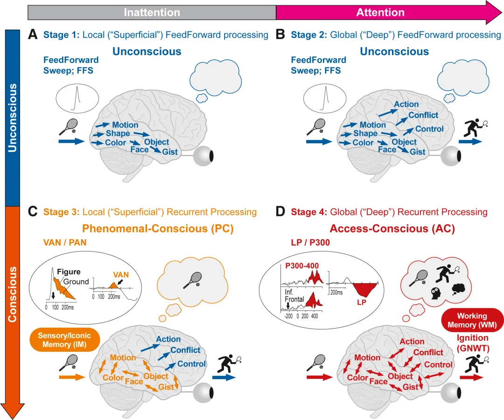

---
tags:
  - papers
  - neuroscience
  - theory
  - mind
  - consciousness
  - TOC
aliases: []
id: theories_of_consciousness
---
Seth, Anil K., and Tim Bayne. “Theories of Consciousness.” Nature Reviews Neuroscience 23, no. 7 (July 2022): 439–52. https://doi.org/10.1038/s41583-022-00587-4.

---
This article focus on the theories of biological and physical basis of
consciousness. The theories of consciousness(ToC) in question are restricted to
those that is plausible to be expressed in neuroscience terms, not concerning
theories linking consciousness directly to quantum mechanical process.
Before delving into varieties of theories, a profile about consciousness is
beneficial. Most of ToCs aim to explain only certain aspects of consciousness.
1. Global states and local states: The former describes the overall subjective
profile including wakefulness, sedation, dreaming. Global states are also known
as *levels of consciousness*. The latter refers to the *content* of
consciousness. For example,
	1. dream of an apple
	2. see an apple
	3. see a banana
	Then 1,2 have different global states, 2,3 have different local states.
2. Phenomenal properties and functional properties: Associated with
[[phenomenology]] and [[functionalism]]. The former pays more attention to inner
subjective experience while the latter to outer objective functions.
3. Attention and distinction of local states: 
	1. Since we can only focus on one thing, why are we focusing on the specific
	one?
	2. What's the experiential difference between different phenomena?
# Theories
## Higher-Order Theories
The core claim that unites all HOTs is that a mental state is conscious in
virtue of being the target of a certain kind of meta-­representational state. It
explains why some contents are conscious while others are not. But some versions
HOTs downplay the functional properties of consciousness. Other versions posit
that the functional roles of consciousness are the metacognitive processes
associated with confidence judgements and error monitoring.

> [!hint] Ideas
> Low-level features extracted from an image encoder are conceivably the
"lower-order" mental states post-processed by, for instance, a cross-attention
module. Here's a caveat: a meta-representation state is ONE state targeted to a
low-level perceptive state. However, in the cross-attention module, the meaning
of a being is distributed over a range of tokens, like "a boy that is hitting a
ball". This may impair the performance when the a pronoun refers to a long
description distributed at different locations of the context. It is hard for
the pronoun to pay attention to so many things.
## Global Workspace Theories
Conscious mental states are those that are "globally available" to a wide range
of cognitive processes including attention, evaluation, memory and verbal
report. GWTs focus on the physical explanation of mental states pertaining to
functionalist properties like attention switching in binocular rivalry.
## Integrated information theory
This theory adopts an mathematical approach by deduction from self-evidently
true axioms. For more information, check out this post [意识到底是如何产生的？能通过技术手段进行读取吗？ - 章彦博的回答 - 知乎](https://www.zhihu.com/question/532951714/answer/2506283467)
## Re-entry/predictive processing theories
These theories place emphasis on the top-down signaling in shaping and enabling
consciousness. Consciousness and unconsciousness can be explained by whether
part of the mental states matches the prediction during perceptual inference. 
## Recurrent processing theory

Source: [An integrative, multiscale view on neural theories of consciousness.](https://doi.org/10.1016/j.neuron.2024.02.004)
## Predictive processing & neurorepresentationalism
The brain accomplishes perceptions by predicting and assessing an internal model from different levels.
## Dendritic integration theory
The layer 5 (L5) pyramidal neurons couples apical and basal dendritic compartments. The nexus is modulated by the projection of higher-order thalamus.
# Comparison
## Unity of Consciousness

It advocates that the experience an agent has at a time seemly occurs as a
component of a single complex experience, one that fully captures what it is
like to be that agent.

IIT emphasize the unity of consciousness as a sufficient and necessary condition
of consciousness by definition. GWTs provides a plausible account of unity of
consciousness by appealing to an association of consciousness with broadcast
within a functionally integrated global workspace. Other CoTs, such as HOTs and
re-entry/predictive processing theories, hold an ambivalent altitude towards the
unity of consciousness. The contrast of different CoTs is partly due to the a
fundamental disagreement over whether consciousness is necessarily unified.

## prefrontal lobe

HOTs and GWTs are naturally supported by the prediction of consciousness from
activity patterns decoded from the prefrontal lobe during binocular rivalry. In
response, IIT and re-entry theories advocates that the observed prefrontal
activity probably occurs as *cognitive access* -- the ability of a mental state
to access a wide range of cognitive process -- and *behavior report* rather than
consciousness per se.

> [!note]
> One innovative study that probed for conscious contents during sleep using a
serial awaken­ing paradigm found that activity in posterior cortical regions
predicted whether an individual would report dream experience, across both rapid
eye movement and non-­rapid eye movement sleep stages. ^[Siclari, F. et al. The neural correlates of dreaming. Nat. Neurosci. 20, 872–878 (2017)]
